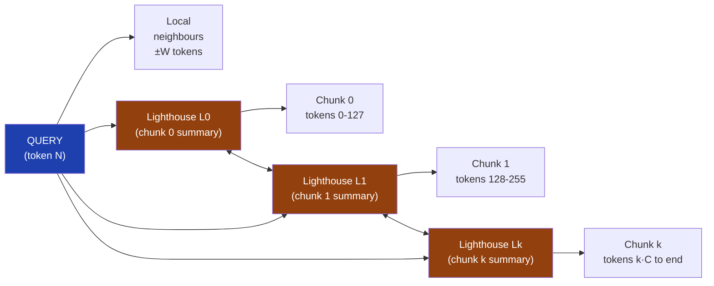
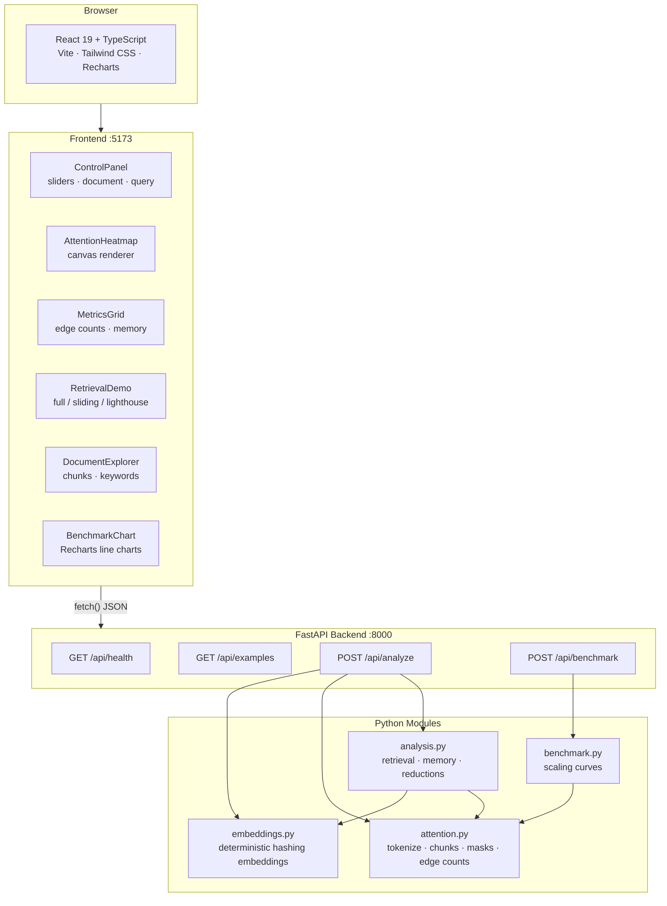
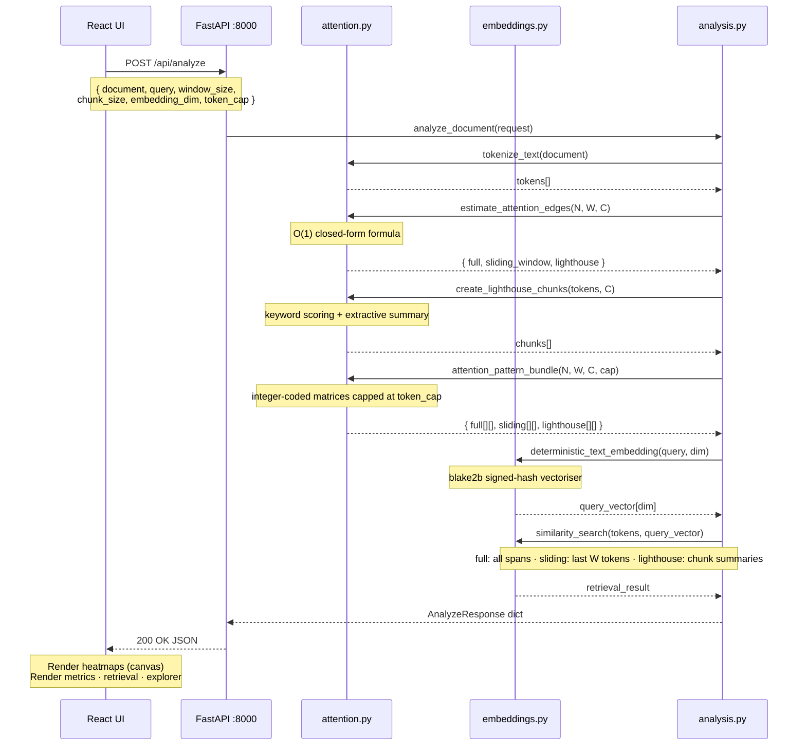
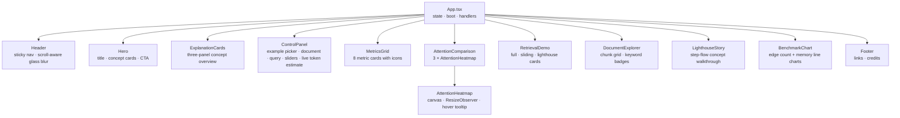

# Lighthouse Attention Lab

[](https://github.com/raghuece455/lighthouse-attention/actions/workflows/ci.yml)
[](https://www.python.org/)
[](https://nodejs.org/)
[](LICENSE)

An interactive, full-stack educational demo that computes and visualises **three attention strategies** — Full, Sliding-Window, and Lighthouse — using real values derived from any text you provide. No external AI models are downloaded. Everything is self-contained.


---

## Table of Contents

- [The Long-Context Problem](#the-long-context-problem)
- [Three Attention Strategies](#three-attention-strategies)
  - [Full Attention](#1-full-attention)
  - [Sliding-Window Attention](#2-sliding-window-attention)
  - [Lighthouse Attention](#3-lighthouse-attention)
- [Complexity at a Glance](#complexity-at-a-glance)
- [Demo Screenshots](#demo-screenshots)
- [System Architecture](#system-architecture)
- [Request / Response Flow](#request--response-flow)
- [Backend Modules](#backend-modules)
- [Frontend Components](#frontend-components)
- [Quick Start](#quick-start)
- [Project Structure](#project-structure)
- [Tech Stack](#tech-stack)
- [Testing](#testing)
- [Documentation Index](#documentation-index)
- [Further Reading](#further-reading)
- [Contributing](#contributing)
- [License](#license)

---

## The Long-Context Problem

Modern AI models read text as a sequence of **tokens** (words or word-pieces). To understand a document, each token must be able to look at other tokens — this is called **attention**.

The naive approach (Full Attention) lets every token attend to every other token. For a document with **N** tokens this creates **N × N** connections. As N grows, the cost becomes prohibitive:

```
N =   512  →      262,144 connections
N = 1,024  →    1,048,576 connections
N = 4,096  →   16,777,216 connections
N = 32,768  →  1,073,741,824 connections   ← impractical
```

Two common solutions exist — both with trade-offs. **Lighthouse Attention** is a middle path that this demo exists to explain.

---

## Three Attention Strategies

### 1. Full Attention

Every token can attend to every other token. Maximum information, quadratic cost.

```
Tokens:  T0   T1   T2   T3   T4   T5   T6   T7
         ─────────────────────────────────────
    T0 [  ■    ■    ■    ■    ■    ■    ■    ■ ]
    T1 [  ■    ■    ■    ■    ■    ■    ■    ■ ]
    T2 [  ■    ■    ■    ■    ■    ■    ■    ■ ]
    T3 [  ■    ■    ■    ■    ■    ■    ■    ■ ]
    T4 [  ■    ■    ■    ■    ■    ■    ■    ■ ]
    T5 [  ■    ■    ■    ■    ■    ■    ■    ■ ]
    T6 [  ■    ■    ■    ■    ■    ■    ■    ■ ]
    T7 [  ■    ■    ■    ■    ■    ■    ■    ■ ]

■ = allowed   ·  = blocked
Complexity: O(N²)   |   Connections: 64   |   Problem: scales quadratically
```

---

### 2. Sliding-Window Attention

Each token can only attend to a fixed-size window of its neighbours. Cheap, but blocks distant evidence.

```
Tokens:  T0   T1   T2   T3   T4   T5   T6   T7       Window W = 2
         ─────────────────────────────────────
    T0 [  ■    ■    ■    ·    ·    ·    ·    · ]
    T1 [  ■    ■    ■    ■    ·    ·    ·    · ]
    T2 [  ■    ■    ■    ■    ■    ·    ·    · ]
    T3 [  ·    ■    ■    ■    ■    ■    ·    · ]
    T4 [  ·    ·    ■    ■    ■    ■    ■    · ]
    T5 [  ·    ·    ·    ■    ■    ■    ■    ■ ]
    T6 [  ·    ·    ·    ·    ■    ■    ■    ■ ]
    T7 [  ·    ·    ·    ·    ·    ■    ■    ■ ]

Complexity: O(N · W)   |   Connections: 46   |   Problem: T7 (the query) cannot reach T0
```

**The hidden-evidence failure:**

```
  Document layout:
  ┌──────────────────────────────────────────────────────────────────┐
  │  [Answer lives here: token 0]  ··· 498 filler tokens ···  [QUERY]│
  └──────────────────────────────────────────────────────────────────┘

  Full Attention  →  QUERY can see token 0  ✓
  Sliding Window  →  QUERY window = [498..500], token 0 is out of range  ✗
```

---

### 3. Lighthouse Attention

Split the document into **chunks**. Create one **lighthouse token** per chunk as an extractive summary guidepost. Normal tokens keep their local window and also attend to all lighthouse tokens. Lighthouse tokens read their own chunk and each other.

```
Tokens:  T0   T1   T2   T3   T4   T5   T6   T7   L0   L1     W=2, chunk=4
         ──────────────────────────────────────────────────
    T0 [  ■    ■    ■    ·    ·    ·    ·    ·    ◆    ◆  ]
    T1 [  ■    ■    ■    ■    ·    ·    ·    ·    ◆    ◆  ]
    T2 [  ■    ■    ■    ■    ■    ·    ·    ·    ◆    ◆  ]  ← normal tokens:
    T3 [  ·    ■    ■    ■    ■    ■    ·    ·    ◆    ◆  ]    local window
    T4 [  ·    ·    ■    ■    ■    ■    ■    ·    ◆    ◆  ]    + all lighthouses
    T5 [  ·    ·    ·    ■    ■    ■    ■    ■    ◆    ◆  ]
    T6 [  ·    ·    ·    ·    ■    ■    ■    ■    ◆    ◆  ]
    T7 [  ·    ·    ·    ·    ·    ■    ■    ■    ◆    ◆  ]
    ────────────────────────────────────────────────────────
    L0 [  ▲    ▲    ▲    ▲    ·    ·    ·    ·    ●    ●  ]  ← lighthouse:
    L1 [  ·    ·    ·    ·    ▲    ▲    ▲    ▲    ●    ●  ]    reads own chunk
                                                                 + all lighthouses

■ local/full    ◆ token→lighthouse    ▲ lighthouse→chunk    ● lighthouse↔lighthouse
```

**The routing path:**



**Result:** T7 (the query) can still reach T0 via the lighthouse guidepost — at a fraction of the cost of full attention.

---

## Complexity at a Glance

| Method | Theoretical | N = 512 | N = 1,024 | N = 4,096 |
|---|---|---:|---:|---:|
| Full Attention | O(N²) | 262,144 | 1,048,576 | 16,777,216 |
| Sliding Window | O(N · W) | 33,280 | 66,560 | 266,240 |
| Lighthouse | O(N·W + N·L + L²) | 34,816 | 69,888 | 279,040 |
| **Lighthouse vs Full** | | **–87%** | **–93%** | **–98%** |

> W = window size (default 32), L = number of lighthouse tokens = ⌈N / chunk_size⌉ (default chunk_size = 128)

---

## Demo Screenshots

| Screenshot | What it shows |
|---|---|
|  | Landing page explaining the three attention types |
|  | Document input, query field, and parameter sliders |
|  | Side-by-side masks: full square, diagonal band, lighthouse pattern |
|  | Query routing: full finds best evidence, sliding may block it, lighthouse routes via summaries |
|  | Chunks with extractive summaries and top keywords; selected chunk highlighted |
|  | Edge counts and fp16 memory scaling as N grows |

---

## System Architecture



---

## Request / Response Flow



---

## Backend Modules

| File | Responsibility | Key functions |
|---|---|---|
| `app/main.py` | FastAPI app, CORS, route wiring | — |
| `app/schemas.py` | Pydantic request/response models | `AnalyzeRequest`, `AnalyzeResponse`, `BenchmarkRequest` |
| `app/attention.py` | Tokenisation, chunk creation, edge counts, pattern matrices | `tokenize_text`, `create_lighthouse_chunks`, `estimate_attention_edges`, `build_attention_pattern` |
| `app/embeddings.py` | Deterministic signed-hash text vectors | `deterministic_text_embedding`, `similarity_score` |
| `app/analysis.py` | Orchestrates a full `/api/analyze` request | `analyze_document`, `compute_retrieval_demo` |
| `app/benchmark.py` | Scaling curves for `/api/benchmark` | `run_benchmark` |
| `app/examples.py` | Three built-in long documents | `get_examples` |

### How edge counts are computed

```
Full attention     edges = N × N

Sliding window     edges = N × (2K + 1) − K × (K + 1)
                   where K = min(W, N − 1)
                   (O(1) closed-form, exact boundary handling)

Lighthouse         edges = sliding_window_edges          (normal token local windows)
                         + N × L                         (every token → every lighthouse)
                         + N                             (lighthouse reads own chunk ≈ N total)
                         + L × L                         (lighthouse ↔ lighthouse)
                   where L = ⌈N / chunk_size⌉
```

### Attention pattern integer codes

| Code | Colour in UI | Meaning |
|---|---|---|
| `0` | Dark (blocked) | No connection |
| `1` | Blue | Local or full attention allowed |
| `2` | Gold | Normal token attending to lighthouse token |
| `3` | Green | Lighthouse token reading its own chunk |
| `4` | Pink | Lighthouse-to-lighthouse connection |

### Deterministic embedding approach

No model is downloaded. Each token is hashed with `blake2b` to produce two signed float contributions into a `dim`-dimensional vector. The vector is L2-normalised. Similarity is cosine distance mapped to [0, 1].

```python
# Per token:
digest = blake2b(token.encode(), digest_size=16).digest()
vector[first % dim]  += +1.0 if second & 1 else -1.0
vector[third  % dim] += +0.7 if fourth & 1 else -0.7
# Final: vector / ||vector||
```

This produces real, repeatable similarity values from any text without semantic meaning.

---

## Frontend Components



**State managed in `App.tsx`:**

| State | Type | Purpose |
|---|---|---|
| `examples` | `ExampleDocument[]` | Loaded from `GET /api/examples` on boot |
| `documentText` | `string` | User-editable document |
| `query` | `string` | User-editable query |
| `controls` | `ControlValues` | Sliders: window, chunk, dim, token cap |
| `analysis` | `AnalyzeResponse \| null` | Latest result from `POST /api/analyze` |
| `benchmarkData` | `BenchmarkResponse \| null` | Latest result from `POST /api/benchmark` |
| `loading` | `boolean` | Spinner during requests |
| `error` | `string \| null` | Error banner message |

---

## Quick Start

```bash
git clone https://github.com/raghuece455/lighthouse-attention.git
cd lighthouse-attention
```

**Option A — Two terminals (recommended for development):**

```bash
# Terminal 1 — backend
cd backend && python -m venv .venv
source .venv/bin/activate          # Windows: .venv\Scripts\activate
pip install -r requirements.txt
uvicorn app.main:app --reload --port 8000

# Terminal 2 — frontend
cd frontend && npm install && npm run dev
```

Open **http://localhost:5173**

**Option B — Docker Compose:**

```bash
docker-compose up --build
```

See [SETUP.md](SETUP.md) for full platform-specific instructions, environment variables, and troubleshooting.

---

## Project Structure

```text
lighthouse-attention/
├── README.md
├── SETUP.md
├── CONTRIBUTING.md
├── LICENSE
├── docker-compose.yml
├── .github/
│   └── workflows/
│       └── ci.yml              ← GitHub Actions: pytest + npm build
├── docs/
│   ├── images/                 ← 6 screenshots for articles / presentations
│   ├── ARCHITECTURE.md         ← deep-dive system design
│   ├── CONCEPTS.md             ← educational reference: attention theory
│   └── API.md                  ← complete endpoint reference
├── backend/
│   ├── Dockerfile
│   ├── requirements.txt        ← version-pinned Python deps
│   ├── pytest.ini
│   └── app/
│       ├── main.py             ← FastAPI app + CORS
│       ├── schemas.py          ← Pydantic models
│       ├── attention.py        ← tokeniser · chunks · masks · edge counts
│       ├── embeddings.py       ← deterministic hash embeddings
│       ├── analysis.py         ← request orchestration · retrieval
│       ├── benchmark.py        ← scaling curve calculator
│       └── examples.py         ← three built-in documents
│   └── tests/
│       ├── test_api.py
│       ├── test_attention.py
│       └── test_embeddings.py
├── frontend/
│   ├── Dockerfile
│   ├── package.json
│   ├── vite.config.ts
│   ├── tailwind.config.js
│   ├── index.html
│   └── src/
│       ├── App.tsx             ← root component + state
│       ├── lib/
│       │   ├── api.ts          ← typed fetch wrappers
│       │   ├── types.ts        ← TypeScript interfaces
│       │   └── format.ts       ← number/memory formatters
│       └── components/
│           ├── ui/             ← Badge · Button · Card · Slider · Tabs · Tooltip
│           ├── Header.tsx      ← sticky nav with scroll-aware glass effect
│           ├── Hero.tsx
│           ├── ExplanationCards.tsx
│           ├── ControlPanel.tsx
│           ├── AttentionHeatmap.tsx
│           ├── AttentionComparison.tsx
│           ├── MetricsGrid.tsx
│           ├── RetrievalDemo.tsx
│           ├── DocumentExplorer.tsx
│           ├── LighthouseStory.tsx
│           ├── BenchmarkChart.tsx
│           └── Footer.tsx
└── scripts/
    ├── dev.sh                  ← start both servers (macOS/Linux)
    └── test.sh                 ← run pytest + npm build
```

---

## Tech Stack

### Backend

| Library | Version | Purpose |
|---|---|---|
| Python | 3.12 | Runtime |
| FastAPI | ≥0.111 | REST API framework |
| Uvicorn | ≥0.29 | ASGI server |
| Pydantic | ≥2.7 | Request/response validation |
| NumPy | ≥1.26 | Vector math for embeddings |
| pytest | ≥8.0 | Test runner |
| httpx | ≥0.27 | Test client |

### Frontend

| Library | Version | Purpose |
|---|---|---|
| React | 19 | UI framework |
| TypeScript | 5 | Static typing |
| Vite | 7 | Dev server + bundler |
| Tailwind CSS | 3 | Utility-first styling |
| Recharts | 3 | Benchmark line charts |
| Framer Motion | 12 | Hero animations |
| Lucide React | latest | Icons |

---

## Testing

**Backend (pytest):**

```bash
cd backend
pytest -v
```

28 tests covering: health endpoint, examples endpoint, analyze endpoint, edge count math, lighthouse pattern shape, tokeniser, retrieval blocking, embedding determinism, embedding distinctiveness, chunk coverage, chunk IDs, chunk summaries and keywords, memory estimate ratios, `reduction_percent` edge cases, `validate_lengths` dedup/sort/cap, and API request-size validation (oversized document, empty document, too-many benchmark lengths).

**Frontend (TypeScript + Vite build):**

```bash
cd frontend
npm run build    # tsc --noEmit && vite build
```

**Both at once:**

```bash
./scripts/test.sh    # macOS/Linux
```

**CI:** Every push to `main` runs both checks automatically via `.github/workflows/ci.yml`.

---

## Documentation Index

| File | Contents |
|---|---|
| [SETUP.md](SETUP.md) | Step-by-step install for macOS, Linux, Windows, Docker |
| [CONTRIBUTING.md](CONTRIBUTING.md) | How to contribute, PR checklist, code style |
| [docs/ARCHITECTURE.md](docs/ARCHITECTURE.md) | Deep-dive system design, module interactions, data flow |
| [docs/CONCEPTS.md](docs/CONCEPTS.md) | Educational reference: attention theory, complexity proofs |
| [docs/API.md](docs/API.md) | Complete REST API reference with example payloads |
| [DEMO_REPORT.md](DEMO_REPORT.md) | Original build report: what was built and why |

---

## Further Reading

These papers explore efficient attention mechanisms that inspired the lighthouse concept:

- **Longformer** (Beltagy et al., 2020) — sliding window + global tokens: [arxiv.org/abs/2004.05150](https://arxiv.org/abs/2004.05150)
- **BigBird** (Zaheer et al., 2020) — sparse attention with global, local, and random tokens: [arxiv.org/abs/2007.14062](https://arxiv.org/abs/2007.14062)
- **Reformer** (Kitaev et al., 2020) — locality-sensitive hashing for attention: [arxiv.org/abs/2001.04451](https://arxiv.org/abs/2001.04451)
- **FlashAttention** (Dao et al., 2022) — IO-aware exact attention: [arxiv.org/abs/2205.14135](https://arxiv.org/abs/2205.14135)

> This project is an educational approximation. It is not an exact implementation of any single paper.

---

## Contributing

See [CONTRIBUTING.md](CONTRIBUTING.md) for setup instructions, the PR checklist, and code style guidelines.

---

## License

[MIT](LICENSE) © 2025 Raghunath Juluri
