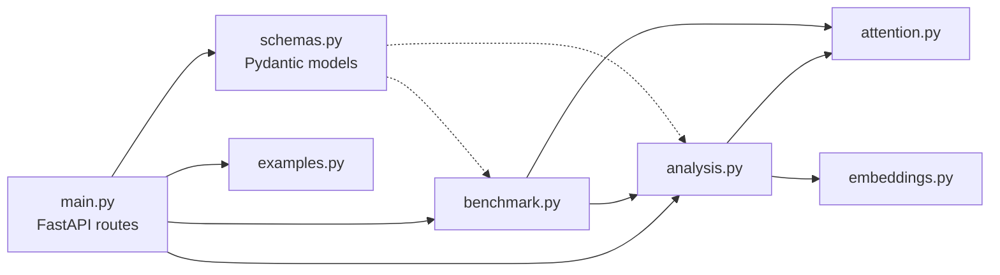
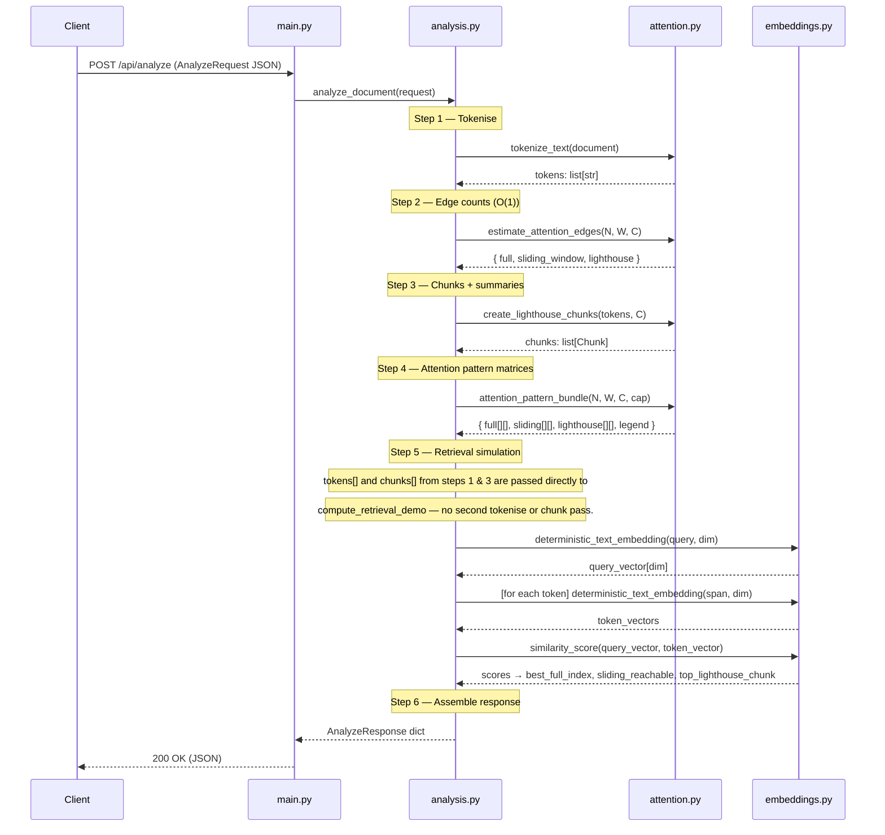
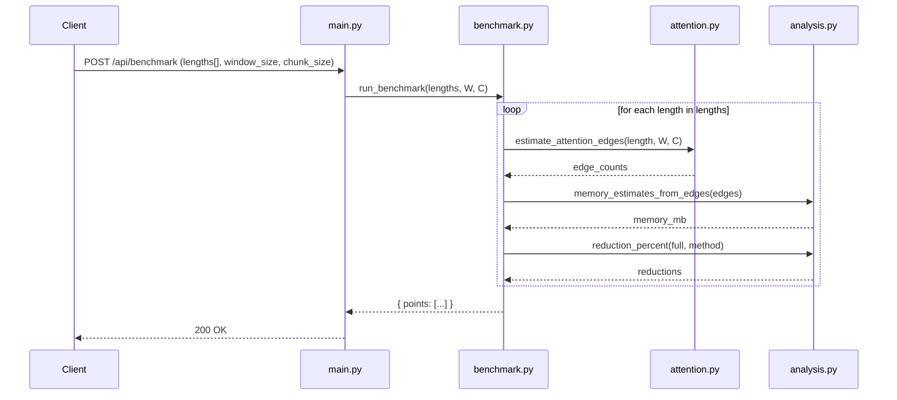

# Architecture

Deep-dive into how Lighthouse Attention Lab is structured, how its components interact, and why specific design decisions were made.

---

## Table of Contents

- [System Overview](#system-overview)
- [Backend Architecture](#backend-architecture)
  - [Module Dependency Graph](#module-dependency-graph)
  - [Request Lifecycle — /api/analyze](#request-lifecycle----apianalyze)
  - [Request Lifecycle — /api/benchmark](#request-lifecycle----apibenchmark)
  - [Tokeniser Design](#tokeniser-design)
  - [Chunk and Summary Algorithm](#chunk-and-summary-algorithm)
  - [Edge Count Algorithm](#edge-count-algorithm)
  - [Attention Pattern Matrix](#attention-pattern-matrix)
  - [Embedding and Retrieval](#embedding-and-retrieval)
- [Frontend Architecture](#frontend-architecture)
  - [Component Tree](#component-tree)
  - [State Management](#state-management)
  - [Canvas Heatmap Renderer](#canvas-heatmap-renderer)
  - [API Layer](#api-layer)
- [Data Contracts](#data-contracts)
  - [AnalyzeRequest](#analyzerequest)
  - [AnalyzeResponse](#analyzeresponse)
  - [BenchmarkRequest](#benchmarkrequest)
  - [BenchmarkResponse](#benchmarkresponse)
- [Design Decisions](#design-decisions)

---

## System Overview

```
┌────────────────────────────────────────────────────────────────────┐
│  Browser                                                           │
│                                                                    │
│  ┌───────────────────────────────────────────────────────────┐    │
│  │  React 19 + TypeScript + Vite                             │    │
│  │  Tailwind CSS  ·  Recharts  ·  Framer Motion              │    │
│  │                                                           │    │
│  │  http://localhost:5173                                    │    │
│  └───────────────────────┬───────────────────────────────────┘    │
│                           │  fetch() over HTTP/JSON               │
└───────────────────────────┼────────────────────────────────────────┘
                            │
                ┌───────────▼───────────┐
                │  FastAPI + Uvicorn    │
                │  http://localhost:8000│
                │                      │
                │  GET  /api/health     │
                │  GET  /api/examples   │
                │  POST /api/analyze    │
                │  POST /api/benchmark  │
                └───────────┬───────────┘
                            │
        ┌───────────────────┼───────────────────┐
        │                   │                   │
  ┌─────▼──────┐   ┌────────▼──────┐   ┌───────▼───────┐
  │attention.py│   │embeddings.py  │   │benchmark.py   │
  │            │   │               │   │               │
  │ tokenise   │   │ hash-embed    │   │ scaling curves│
  │ chunk      │   │ cosine sim    │   │               │
  │ edge-count │   └───────────────┘   └───────────────┘
  │ build mask │
  └────────────┘
        │
  ┌─────▼──────┐
  │analysis.py │
  │            │
  │ orchestrate│
  │ retrieval  │
  │ memory est │
  └────────────┘
```

**Key design principle:** The backend is entirely stateless. Every `/api/analyze` request is self-contained — no session, no database, no cache. This makes the demo safe to deploy and trivial to reason about.

---

## Backend Architecture

### Module Dependency Graph



Dependencies flow downward. `attention.py` and `embeddings.py` have no imports from this project — they are pure algorithmic modules.

### Module Responsibilities

| Module | Imports from project | Pure? | Description |
|---|---|---|---|
| `main.py` | all | No | Wires routes to handlers; adds CORS middleware; structured logging |
| `schemas.py` | — | Yes | Pydantic validation models with field-level size constraints |
| `attention.py` | — | Yes | Tokenisation, chunking, masking, edge counts |
| `embeddings.py` | `attention.py` | Yes | Deterministic hashing embeddings |
| `analysis.py` | `attention`, `embeddings`, `schemas` | Yes | Orchestrates a full analyse request; `compute_retrieval_demo` accepts pre-computed tokens and chunks to avoid redundant work |
| `benchmark.py` | `attention`, `analysis` | Yes | Produces scaling curve data points; owns `validate_lengths` |
| `examples.py` | — | Yes | Returns built-in example documents (list built once at import time) |

---

### Request Lifecycle — /api/analyze



**Timing breakdown (typical 500-token document):**

| Step | Approx time |
|---|---|
| Tokenise | < 1 ms |
| Edge counts | < 0.1 ms |
| Chunking + summaries | 2–5 ms |
| Attention pattern matrices | 5–15 ms (bounded by cap²) |
| Retrieval simulation | 10–30 ms (N embeddings) |
| **Total** | **~20–50 ms** |

---

### Request Lifecycle — /api/benchmark



No attention matrices are allocated for benchmark requests. Only the O(1) formula is used for each length.

---

### Tokeniser Design

Located in `attention.py`:

```python
TOKEN_PATTERN = re.compile(
    r"[A-Za-z]+(?:[-'][A-Za-z]+)?|\d+(?:\.\d+)?|[^\w\s]",
    re.UNICODE
)
```

This pattern matches:

| Pattern | Matches |
|---|---|
| `[A-Za-z]+(?:[-'][A-Za-z]+)?` | Words including hyphenated and contracted forms: `well-known`, `don't` |
| `\d+(?:\.\d+)?` | Integers and decimals: `42`, `3.14` |
| `[^\w\s]` | Punctuation: `.`, `,`, `;`, `!`, `?` |

**Why a regex tokeniser?** The project must be self-contained with no model downloads. A regex tokeniser is deterministic, dependency-free, and fast. Token counts will differ from BPE/SentencePiece tokenisers used in real LLMs (typically 20–40% more tokens for the same text).

---

### Chunk and Summary Algorithm

Located in `attention.py → create_lighthouse_chunks`.

```
Input:  tokens[], chunk_size C
Output: Chunk[]  (chunk_id, start_token, end_token, top_keywords, summary, text)

For each chunk i covering tokens[i*C : (i+1)*C]:

  1. keyword_counts = Counter of normalised non-stopword words
  2. top_keywords   = most_common(6) words by frequency
  3. summary        = best scoring sentence by keyword density:
                      score(sentence) = Σ keyword_freq / √(sentence_word_count)
  4. If best sentence < 18 tokens: extend to 28 tokens from that start position
     If best sentence > 35 tokens: truncate to 35 tokens
```

**Sentence boundary detection** uses `_sentence_spans`, which returns `(start_index, tokens)` tuples — the start index is tracked during construction so the summary extension never needs a linear `list.index()` search.

---

### Edge Count Algorithm

Located in `attention.py → estimate_attention_edges`.

All three counts are derived analytically — no matrix is allocated.

```python
# Full attention
full = seq_len * seq_len

# Sliding window (O(1) closed-form, exact boundary handling)
K       = min(window_size, seq_len - 1)
sliding = seq_len * (2 * K + 1) - K * (K + 1)

# Lighthouse
num_lighthouses          = ceil(seq_len / chunk_size)
original_to_local        = sliding
original_to_lighthouses  = seq_len * num_lighthouses
lighthouse_to_own_chunk  = seq_len           # each lighthouse reads C tokens, Σ = N total
lighthouse_to_lighthouses = num_lighthouses * num_lighthouses

lighthouse = (original_to_local
            + original_to_lighthouses
            + lighthouse_to_own_chunk
            + lighthouse_to_lighthouses)
```

**Derivation of the O(1) sliding-window formula:**

The number of pairs (i, j) with |i−j| ≤ W is equivalent to counting pairs at each offset d:

```
d = 0: N pairs
d = 1: 2(N−1) pairs
...
d = K: 2(N−K) pairs   where K = min(W, N−1)

Total = N + 2·Σ(N−d for d=1..K)
      = N + 2·(K·N − K(K+1)/2)
      = N·(2K+1) − K·(K+1)
```

---

### Attention Pattern Matrix

Located in `attention.py → build_attention_pattern`.

The matrix is integer-coded for compactness:

```python
# Full (visual_seq_len × visual_seq_len)
matrix[i][j] = 1  for all i, j

# Sliding (visual_seq_len × visual_seq_len)
matrix[i][j] = 1  if |i−j| <= window_size else 0

# Lighthouse ((visual_seq_len + L) × (visual_seq_len + L))
# Normal token rows (0..visual_seq_len−1):
matrix[i][j]              = 1  if |i−j| <= window_size   (local window)
matrix[i][seq_len + l]    = 2  for all lighthouse l       (token→lighthouse)

# Lighthouse rows (visual_seq_len..total−1):
matrix[seq_len+l][j]      = 3  if j in chunk_l            (lighthouse→chunk)
matrix[seq_len+l][seq_len+l2] = 4  for all l2             (lighthouse↔lighthouse)
```

The matrix is capped at `visualization_token_cap` (default 160) for the normal token portion before building, so the frontend never receives a matrix larger than ~(160+L)² = ~(172)² ≈ 30,000 cells.

---

### Embedding and Retrieval

Located in `embeddings.py` and `analysis.py`.

**Vector construction:**

```
For each token t in text:
  digest = blake2b(t.lower().encode(), digest_size=16)
  vector[int(digest[0:4]) % dim] += +1.0 if digest[4] & 1 else −1.0
  vector[int(digest[8:12]) % dim] += +0.7 if digest[12] & 1 else −0.7

Return vector / ||vector||
```

Two contributions per token reduce hash collisions compared to one.

**Retrieval simulation:**

```
1. Embed query → query_vector

2. Full attention retrieval:
   For every token index i in [0, N):
     Embed span tokens[max(0,i−10) : i+11] → span_vector
     score = cosine_similarity(query_vector, span_vector)
   Best index = argmax(scores)

3. Sliding-window retrieval:
   Same as above, but indices restricted to [N−W, N)
   can_reach_best = (best_full_index >= N−W)

4. Lighthouse retrieval:
   For each chunk:
     Embed (chunk.summary + " " + " ".join(chunk.top_keywords)) → chunk_vector
     score = cosine_similarity(query_vector, chunk_vector)
   Best chunk = argmax(scores)
```

**Why not embed all tokens individually?** Embedding a span of ±10 tokens provides more context than a single token and produces more meaningful similarity scores for the retrieval demo.

---

## Frontend Architecture

### Component Tree

```
App.tsx  (root state, boot, handlers)
│
├── Header.tsx                   (sticky nav, scroll-aware glass blur, section links)
│
├── Hero.tsx                     (title, concept cards with per-card glow colours, CTA)
├── ExplanationCards.tsx         (3-panel: full / sliding / lighthouse, per-card theming)
├── ControlPanel.tsx             (example picker, document textarea, query, sliders)
│   │                            (live token + chunk estimate below textarea)
│   └── ui/Slider.tsx
├── [hint Card]                  (inline in App.tsx — shows hidden_fact_position_hint)
├── [ErrorPanel]                 (inline in App.tsx)
├── [LoadingPanel]               (inline in App.tsx)
│
├── MetricsGrid.tsx              (8 metric cards in two labelled groups)
│   └── ui/Card.tsx
├── AttentionComparison.tsx      (3 × AttentionHeatmap)
│   └── AttentionHeatmap.tsx     (canvas renderer, ResizeObserver, hover tooltip)
├── RetrievalDemo.tsx            (full / sliding / lighthouse retrieval cards)
│   ├── ui/Badge.tsx
│   └── ui/Card.tsx
├── DocumentExplorer.tsx         (chunk grid with keyword badges)
│
├── LighthouseStory.tsx          (step-flow walkthrough with ChevronRight separators)
├── BenchmarkChart.tsx           (edge count + fp16 memory line charts — Recharts)
│   └── [ChartFrame]             (ResizeObserver for responsive width)
└── Footer.tsx                   (Docs + Project columns, MIT licence note)
```

### State Management

All state lives in `App.tsx`. No external state manager (Redux, Zustand) is needed.

```typescript
// Core data
const [examples, setExamples]         = useState<ExampleDocument[]>([]);
const [analysis,  setAnalysis]         = useState<AnalyzeResponse | null>(null);
const [benchmarkData, setBenchmarkData]= useState<BenchmarkResponse | null>(null);

// User inputs
const [selectedExampleId, setSelectedExampleId] = useState("");
const [documentText, setDocumentText]           = useState("");
const [query, setQuery]                         = useState("");
const [controls, setControls]                   = useState<ControlValues>(defaultControls);

// UI state
const [loading, setLoading]       = useState(false);
const [initializing, setInitializing] = useState(true);
const [error, setError]           = useState<string | null>(null);
```

**Boot sequence (single `useEffect` on mount):**

```
1. GET /api/examples → setExamples()
2. Select first example → setDocumentText(), setQuery()
3. POST /api/benchmark (with defaultControls) → setBenchmarkData()
4. POST /api/analyze (with first example) → setAnalysis()
5. setInitializing(false)
```

**Memoisation:**

| Component | What is memoised | Dependency |
|---|---|---|
| `App.tsx` | `selectedExample` | `[examples, selectedExampleId]` |
| `App.tsx` | `runAnalysis` callback | `[controls, documentText, query]` |
| `App.tsx` | `runBenchmark` callback | `[controls]` |
| `App.tsx` | `handleRun` callback | `[runAnalysis, runBenchmark]` |
| `MetricsGrid` | `metrics` array | `[analysis]` |
| `BenchmarkChart` | `data` array transform | `[benchmark]` |
| `AttentionHeatmap` | `uniqueCodes` Set | `[matrix]` |

---

### Canvas Heatmap Renderer

`AttentionHeatmap.tsx` renders to an HTML `<canvas>` element using a `ResizeObserver` to stay responsive.

```
Mount:
  attach ResizeObserver to wrapper div

On resize (or matrix change):
  cssWidth  = wrapper.clientWidth
  cssHeight = min(360, max(240, cssWidth × 0.72))
  canvas physical size = cssWidth × devicePixelRatio (handles retina)

Draw loop:
  cellWidth  = cssWidth / matrix.size
  cellHeight = cssHeight / matrix.size
  for each (row, col):
    fillStyle = colors[matrix[row][col]]
    fillRect(col × cellWidth, row × cellHeight, ...)

  if lighthouse mode:
    draw white divider lines at tokenCount × cellWidth/Height

Mouse events:
  col = floor((x / rect.width) × size)
  row = floor((y / rect.height) × size)
  show tooltip at (hover.x + 12, hover.y − 12)
```

**Why canvas instead of SVG?** A 172×172 lighthouse matrix has 29,584 cells. SVG would create 29,584 DOM elements; canvas draws them in one raster pass in < 1 ms.

---

### API Layer

`src/lib/api.ts` provides three typed functions wrapping `fetch`:

```typescript
const API_BASE_URL = import.meta.env.VITE_API_URL ?? "http://localhost:8000";

async function request<T>(path: string, options?: RequestInit): Promise<T>
// Throws a human-readable error if:
//   - response.ok is false (uses response.json().detail if available)
//   - fetch throws TypeError (backend offline)

export function getExamples(): Promise<ExampleDocument[]>
export function analyze(payload: AnalyzePayload): Promise<AnalyzeResponse>
export function benchmark(payload: BenchmarkPayload): Promise<BenchmarkResponse>
```

---

## Data Contracts

### AnalyzeRequest

```typescript
{
  document:               string    // 1..50,000 characters
  query:                  string    // 1..2,000 characters
  window_size:            number    // 1..512,    default 32
  chunk_size:             number    // 8..1024,   default 128
  embedding_dim:          number    // 8..512,    default 64
  visualization_token_cap:number    // 32..256,   default 160
}
```

### AnalyzeResponse

```typescript
{
  token_count:             number
  chunk_count:             number
  lighthouse_token_count:  number

  edge_counts: {
    full:           number
    sliding_window: number
    lighthouse:     number
  }

  reductions: {
    sliding_vs_full_percent:    number   // 0..100
    lighthouse_vs_full_percent: number
  }

  memory_estimates: {
    full_attention_mb_fp16:        number
    sliding_attention_mb_fp16:     number
    lighthouse_attention_mb_fp16:  number
    full_attention_mb_fp32:        number
    sliding_attention_mb_fp32:     number
    lighthouse_attention_mb_fp32:  number
  }

  attention_patterns: {
    visual_token_count:    number
    visual_lighthouse_count: number
    full:      number[][]   // visual_token_count × visual_token_count
    sliding:   number[][]   // same size
    lighthouse: number[][]  // (visual_token_count + L) × (visual_token_count + L)
    legend: { "0": "blocked", "1": "local attention", ... }
  }

  chunks: Array<{
    chunk_id:     number
    start_token:  number
    end_token:    number
    top_keywords: string[]
    summary:      string
  }>

  retrieval: {
    query: string
    full_attention: {
      top_token_index: number
      score:           number   // 0..1
      snippet:         string
    }
    sliding_window: {
      can_reach_best_token:  boolean
      best_reachable_score:  number
      snippet:               string
    }
    lighthouse_attention: {
      top_chunk_id:  number
      score:         number
      summary:       string
      top_keywords:  string[]
    }
    plain_english_takeaway: string
  }

  runtime_estimates: {
    edge_count_ratio_lighthouse_to_full: number   // 0..1
    edge_count_ratio_sliding_to_full:    number
  }
}
```

### BenchmarkRequest

```typescript
{
  lengths:     number[]   // max 12 items, each ≤ 65,536; default [256, 512, 1024, 2048, 4096]
  window_size: number     // 1..512,  default 32
  chunk_size:  number     // 8..4096, default 128
}
```

### BenchmarkResponse

```typescript
{
  points: Array<{
    length: number
    edge_counts: { full, sliding_window, lighthouse }
    reductions:  { sliding_vs_full_percent, lighthouse_vs_full_percent }
    memory_estimates: { /* same 6 fields as AnalyzeResponse */ }
    safe_runtime_estimates_ms: {
      full:          number
      sliding_window: number
      lighthouse:    number
    }
  }>
}
```

---

## Design Decisions

### Why no database?

The demo is stateless. Every result is recomputed on each request. This eliminates persistence, migrations, and all the complexity that comes with them. For an educational demo that runs locally, compute cost is negligible.

### Why deterministic embeddings instead of a real model?

Real embedding models (sentence-transformers, OpenAI embeddings) require either a large download or an API key with rate limits. Both create friction for a demo. The deterministic blake2b approach produces real, repeatable similarity values from any text without semantic meaning — sufficient to demonstrate the *structural* difference between retrieval strategies.

### Why FastAPI instead of Flask or Django?

FastAPI's Pydantic integration gives request validation and response serialisation for free. The auto-generated `/docs` Swagger UI lets users explore the API without a separate tool. Uvicorn's async server handles the concurrency needs of a demo with zero configuration.

### Why Vite instead of Create React App?

Vite's dev server is significantly faster for HMR. The manual chunk splitting in `vite.config.ts` keeps the initial page load small by separating `recharts`, `framer-motion`, and `lucide-react` into separate bundles loaded on demand.

### Why canvas for heatmaps instead of SVG or a charting library?

A capped-at-160 normal token count plus lighthouse tokens produces a matrix of up to ~172×172 = 29,584 cells. SVG creates one DOM element per cell (29,584 nodes). Canvas renders everything in a single raster pass and handles retina displays via `devicePixelRatio`. The trade-off is that canvas is less accessible (addressed with `role="img"` and `aria-label`).

### Why cap the visualization matrix?

The `/api/analyze` request uses `visualization_token_cap` (default 160) to limit the matrix size returned to the frontend. The edge *counts* always use the real full sequence length. This means the heatmap shows a representative sample while metrics remain accurate. Without the cap, a 2,000-token document would produce a 2,000×2,000 matrix (4 million cells) that would be slow to transmit and impossible to render clearly.
