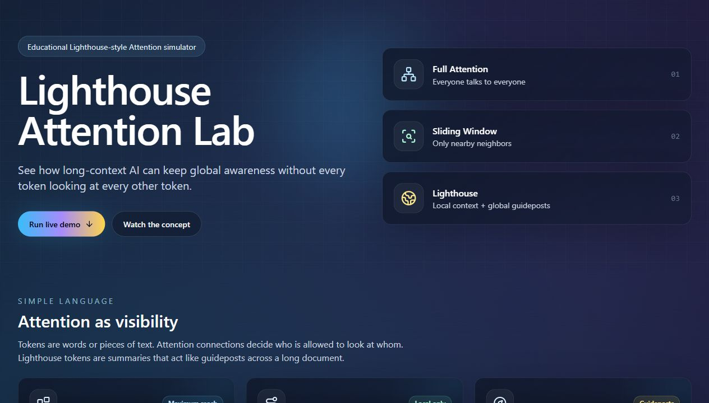
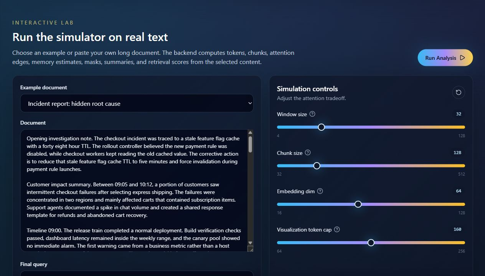
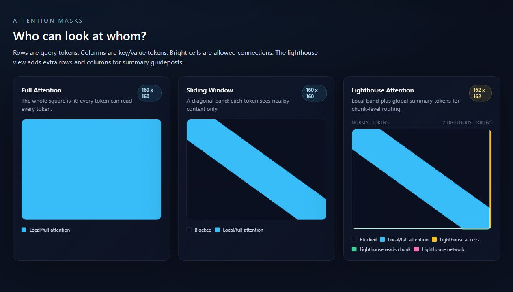
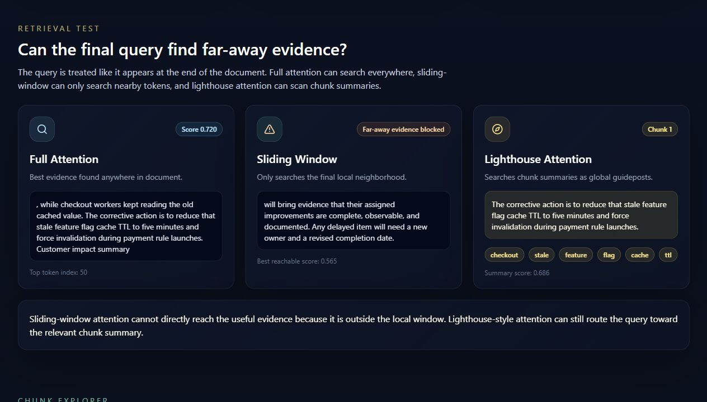
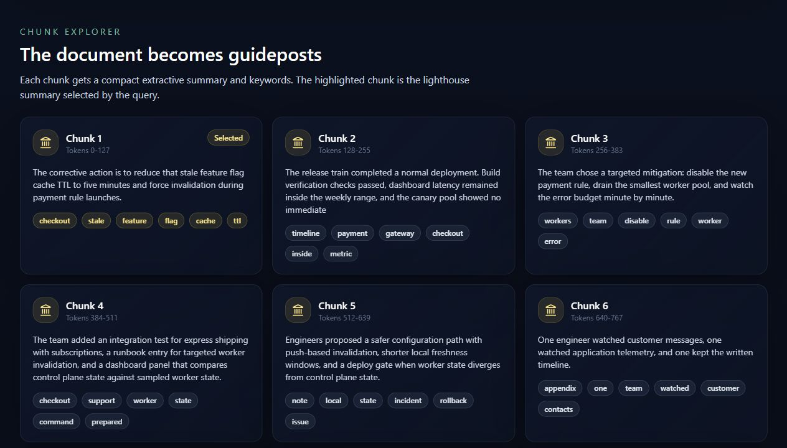
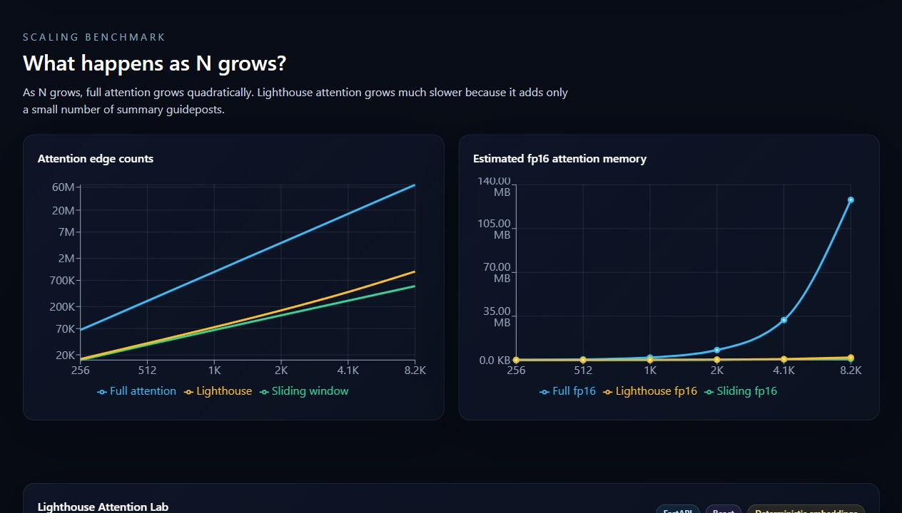

# Article Assets

Use these screenshots from `docs/images/` when writing an article or internal explainer about Lighthouse-style Attention.

## 1. Hero Overview

Suggested caption:

> Lighthouse Attention Lab introduces full attention, sliding-window attention, and lighthouse-style guideposts in a polished interactive demo.

## 2. Interactive Controls

Suggested caption:

> The demo computes values from the selected document, query, window size, chunk size, embedding dimension, and visualization cap.

## 3. Attention Heatmaps

Suggested caption:

> Rows are query tokens and columns are key/value tokens. Full attention lights up the whole square, sliding-window attention becomes a diagonal band, and lighthouse-style attention adds summary-token rows and columns.

## 4. Retrieval Demo

Suggested caption:

> A final query can search the whole document with full attention, may be blocked by sliding-window attention, and can route toward a relevant chunk summary with lighthouse-style attention.

## 5. Document Explorer

Suggested caption:

> The document is split into chunks. Each chunk gets keywords and a short extractive summary, which acts like a lighthouse guidepost.

## 6. Benchmark Charts

Suggested caption:

> Full attention grows quadratically as sequence length increases. Lighthouse-style attention uses far fewer direct connections while preserving a route to global information.

